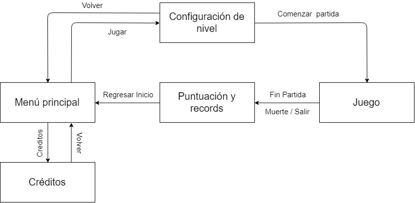
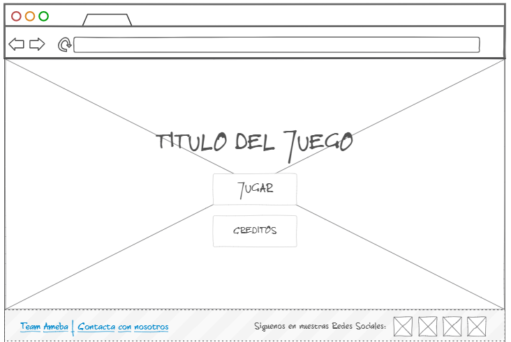
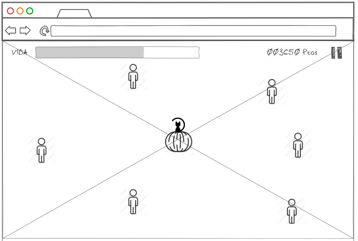
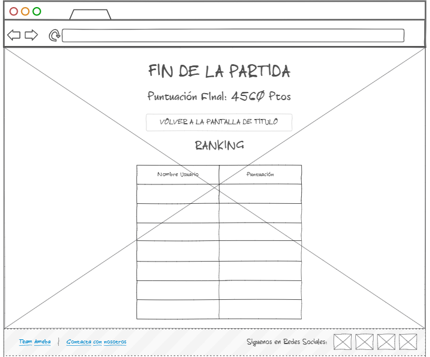

# Beware the Candy Kids

## ÍNDICE

### 0. Cambios ###

### 1. Introducción ###

   >1.1. Concepto de videojuego
   
En Beware the Candy Kids el jugador se enfrenta a una horda de niños hambrientos de caramelos. Tendrá que conseguir alimentarlos antes de que alcancen el centro de la pantalla.

   >1.2. Características principales
   
* Jugabilidad sencilla: Una mecánica simple que sea divertida tanto en ordenador como en móvil, al ser un juego de navegador accesible en cualquier plataforma.

* Ambientación temática de Halloween. Tanto en el apartado visual como auditivo.

* Curva de dificultad que mantenga el flow del juego. Que no resulte frustrante ni aburrida.

>1.3. Género
   
Beware the Candy Kids se acerca al género de shoot ‘em up o tower defense.

   >1.4. Público objetivo
  
Está enfocado a todo tipo de jugadores casuales, ya que es sencillo y accesible.

   >1.5 Jugabilidad
  
Cada nivel del juego consiste en una oleada de niños hambrientos a los que, para saciar su hambre, tendrá que ir lanzando caramelos el jugador. Según el disfraz que tengan los niños tendrán un comportamiento u otro al recibir el caramelo.

   >1.6 Estilo visual
  
Beware the Candy Kids tendrá un estilo amigable, evocando un ambiente de Halloween, con colores pastel y negro.
 
  >1.7 Alcance
  
La meta durante este desarrollo es realizar un juego pequeño y divertido, que se pueda jugar repetidas veces sin que resulte repetitivo.

### 2. Mecánicas de juego ###

   >2.1. Jugabilidad
   
El juego se divide en oleadas. En todas ellas, el personaje del jugador, un gato en una calabaza, se encuentra en el centro de la pantalla y van entrando a la pantalla niños hambrientos a los que hay que lanzar caramelos, que será la única acción de la que dispondrá el jugador.

 Todos los niños avanzan acercándose al centro de la pantalla, si uno llega se acaba la partida. Pero según el disfraz que tengan pueden tener diferentes comportamientos al recibir el caramelo. Principalmente retirarse o exigir un nuevo caramelo después de realizar una acción como desplazarse.
 
 La progresión de dificultad va muy determinada por la estructura en oleadas del juego. De modo que cada oleada comenzará con una dificultad reducida y se irá incrementando hasta el final de la misma. Siendo cada oleada a su vez más difícil que la anterior. La dificultad viene determinada por el tipo de niños que aparecen, pero sobre todo por la cantidad.De esta forma buscamos que el jugador tenga momentos de calma, al comienzo de cada oleada, y momentos de tensión, al final.
  
  >2.2. Flujo de juego
  
Al iniciar el juego aparecerá un menú principal donde existirán las opciones de jugar o ver los créditos. Al pulsar en el botón de jugar se solicitará al jugador que introduzca su nombre y especifique la dificultad a la que quiere enfrentarse (lo que hará variar el número de niños). A partir de ahí comenzará el juego en la primera oleada, donde habrá que lanzar caramelos a todos los niños que vayan viniendo. Conforme se vaya superando cada oleada se pasará a la siguiente.
 En el momento que un niño cualquiera llegue al centro de la pantalla, alcanzando al gato, se ejecutará la animación de derrota y se pasará a la pantalla de game over, donde se verá la puntuación y los récords y se permitirá al jugador volver al menú principal.
   
   >2.3. Personajes
  
* Protagonista: Será un gato dentro de una calabaza. Su única habilidad y objetivo será lanzar caramelos a los niños.

* Niños:

  * Vampiro (básico): Al recibir un caramelo desaparecerá de la pantalla.
  
  * Monstruo de Frankenstein: Necesitará 3 caramelos para irse.
  
  * Niño-lobo: Al recibir un caramelo se desplazará y exigirá otro caramelo.
  
  * Brujo: Similar al anterior, pero en vez de desplazarse se teletransportará a otro lugar de la pantalla.
  
  * Demonio: Al recibir un caramelo, se dividirá en dos enemigos. Hará esto dos veces y luego se retirará.
  
  
>2.4. Movimiento 
  
El jugador no podrá moverse, estará anclado al centro de la pantalla en todo momento.

Los niños simplemente caminarán hacia el centro, excepto los que tengan disfraces especiales, que tendrán acciones especiales al recibir caramelos.
 
  >2.5. Controles
  
El único control será hacer click o tap sobre los niños para lanzarles caramelos.

### 3. Interfaz ###

A continuación se muestra el diseño de interfaz con las diferentes pantallas que forman el videojuego. Se muestra tanto las diferentes pantallas así como su conexión entre ellas a través de un diagrama de flujo. Posteriormente, se presentan los esquemas bocetados de cada una de ellas. Estos esquemas solo muestran una distribución de elementos a priori. Es el diseñador y artista el que debe darle estilo, imagenes y forma según los elementos con la que la componga. 

  >3.1. Diagrama de flujo
  
  En el siguiente diagrama se muestran las diversas pantallas y cómo se conectan entre sí:
  
  
  >3.2. Menú principal
  
  

  >3.3. Configuración de nivel
  
  Esta pantalla de momento solo muestra una configuración básica (nombre y dificultad). En un futuro podría mostrar más información que se considere oportuna durante el desarrollo.
   
  
  >3.4. Pantalla de Juego
  
  Se muestra un boceto de lo que sería la pantalla de juego. Los niños son representados por el icono de persona. El gato sobre la calabaza se sitúa al centro.
  

  >3.5. Fin del juego
  
  

  >3.6. Créditos
  
  

  
### 4. Arte ###

Beware the Candy Kids es un videojuego que desea transmitir al jugador una sensación de ambiente festivo y feliz pero espeluznante y grotesco al mismo tiempo. Bajo una capa de colores pastel y personajes amigables se esconde una temática oscura con la que no se puede olvidar que los niños de este videojuego son tus enemigos y harán lo que sea para conseguir caramelos, lo que sea.

  >4.1. Arte 2D
  Las imágenes estarán en formatos .jpeg ya que es el más indicado para trabajar en web. Asimismo cada una deberá pesar 100KB como máximo. 

* **Interfaz**: 
   * Logo: Habrá dos logos. Uno más minimalista y con un elemento representativo del juego (calabaza o caramelo) y otro con las letras del título. Colores otoñales (ocres)
   * GUI: Las pantallas vistas anteriormente realizadas con la paleta del videojuego.
   * Puntero: Un puntero normal con la paleta de colores correspondiente.

* **Personaje principal**:
   * El gato y la calabaza: Un gato muy adorable encerrado en una calabaza llena de caramelos y de la que no puede escapar. La calabaza cambia de expresión constantemente.

* **Niños**: ¿Están disfrazados o son niños de verdad?
   * Vampiro: Sencillos y los más básicos.
   * Monstruo de Frankestein: La versión más fortachona de los anteriores a nivel de mecánicas
   * Niño-lobo: Un nivel más por delante que los nombrados ya.
   * Brujo: Serían los más poderosos de no ser por los siguientes.
   * Demonio: Todos los respetan y parecen ser la máxima autoridad de esta locura.
	
* **Escenario**

   * Vista cenital de lo que parece ser la plaza de una ciudad. Es de noche pero las antorchas mantienen iluminado el camino. Se pueden apreciar variedad de hogares en el fondo.

  >4.2. Audio

